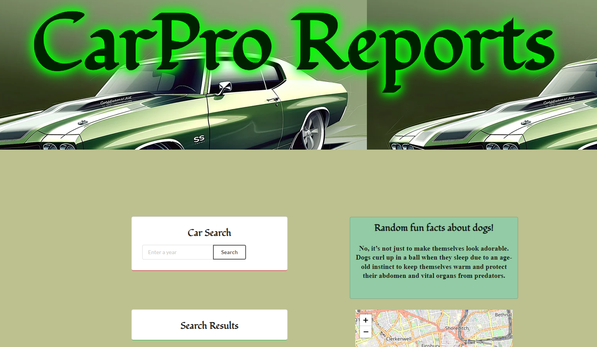

# CarPro Reports

## Navigation Links

+ [User Story](#user-story)
+ [Description](#description)
+ [Usage](#usage)
+ [Deployed Application](#deployed-application)
+ [Technologies Used](#technologies-used) 
+ [Mock-Up](#mock-up)
+ [Future Development](#future-development)
+ [Contributors](#contributors)

## User Story

As a user, I want to search a year of a vehicle so I can see specifications of the vehicles made that year.  
I would also like to see a map so I can view my location along with randomly generated dog facts to keep me entertained on a long road trip.

## Acceptance Criteria
It is done when:

<ul>
<li>The page dynamically updates with documentation parsed from a server-side API</li>
<li>I search a vehicle & I am given details of the vehicle</li>
<li>I search a vehicle & a list is displayed showing the different generations of that make & model</li>
<li>I see a map that can get my location & show me where I am</li>
<li>If I refresh the page or wait 20 seconds a new dog fact will load</li>
<li>When I load the page, I am asked to share my location to the server, which can then be used to search for nearby gas stations</li>
<li>I see random dog facts for entertainment</li>
</ul>

## Description
When this web application loads, the user is met with a clean user interface that has a search bar & a submit button.  
The user is prompted to share their location, and if they choose to do so, the map will use geolocation to locate them & mark their location on the map.  
When the page loads, the user is also met with a random fun fact about dogs; If the user refreshes the page or waits 20 seconds, a new fun fact will be generated. 
 
The search bar will take in a range of years from 1984-present. 
Once the year of choice is submitted, API-Ninjas is used with JavaScript & dynamic HTML & CSS elements to generate a card.  
Each card will include the car's make/model & basic specifications.  

## Usage
This web application provides a way for users to get basic details of the vehicles for the year you search.  

## Deployed Application
<a href="https://chriscodinghub.github.io/CarPro-Reports/">***CarPro Reports***</a>

## Technologies Used
+ HTML
+ CSS
+ Semantic UI
+ JavaScript
+ jQuery

## Mock-Up
The following image shows the web application's appearance & functionality: 

## Future Development
We would like to incorporate the following features:
+ A search bar on the map to find local businesses or other destinations
+ Dropdown menus or some other option to search for a make, model & year to narrow down specific results
+ Generate photos of the searched vehicle
+ Edit the styling for the hero image
+ Include a 'Favorites List' that adds the searched cars 

## Contributors
[Chris](https://github.com/chriscodinghub)  
[Benjamin](https://github.com/bjpippenger)  
[Mack](https://github.com/techmack92) 
